  

 

<h3 align="center">Things i've built ✦</h3>

  <a href="https://github.com/vaish13uh/MIRA">⛏️ MIRA</a>
  &nbsp; • &nbsp;
  <a href="https://github.com/vaish13uh/AutoHedger">🤖 AutoHedger</a>
  &nbsp; • &nbsp;
  <a href="https://github.com/vaish13uh/sentiment-analysis">💭 Sentiment Analysis</a>

  <i>a few things i've built, broken, fixed & learned from ♡</i>

